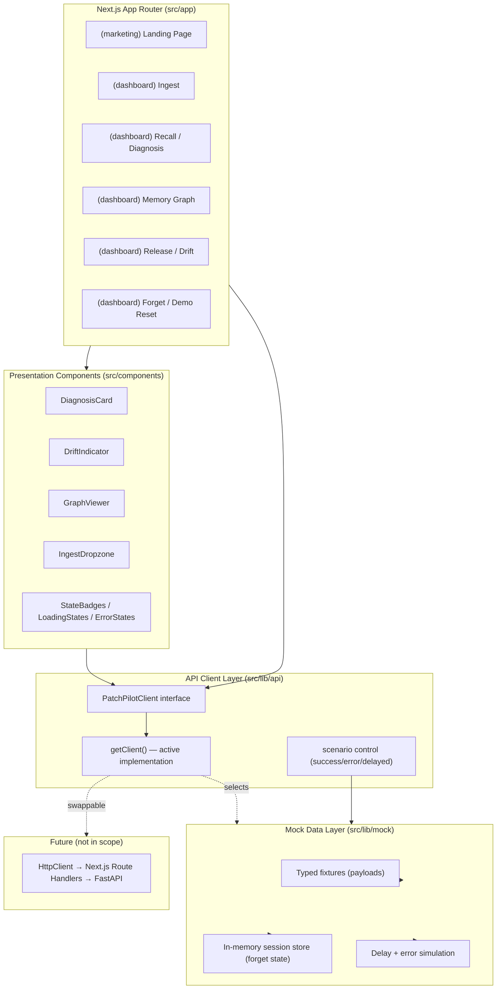

# Design Document

## Overview

This design covers two distinct bodies of work defined by the requirements:

1. **Pre-implementation research and design-direction deliverables** (Requirements 1–6): five documentation artifacts (Hackathon Research Report, Competitor Teardown Report, Design Direction Document, Steering File Set, Stack Research Report) plus a Clarifying Questions Log and a confirmation gate. These are markdown/process deliverables, not application code.

2. **The mock-data-driven frontend implementation** (Requirements 7–10): a typed mock data layer, an API-ready client abstraction, a landing page, the core dashboard pages (ingest, recall/diagnosis, memory graph, release/drift, forget/demo-reset), and a polish audit.

The guiding constraint across both is that the frontend must be **judge-impressing, built independently of the backend, and architected so that real backend integration requires zero rework of consuming components**. Every UI component depends only on a stable client interface; the mock implementation sits behind that interface and is swappable for a real HTTP client without touching any page or component.

The design is grounded in the project research already completed under `.planning/research/` (ARCHITECTURE.md, FEATURES.md, STACK.md, PITFALLS.md, SUMMARY.md) and the workspace steering files (`theming.md`, `tech-stack.md`, `animations.md`, `code-standards.md`, `hackathon-patterns.md`, `ui-ux-review.md`). The backend contract that the mock layer emulates mirrors the FastAPI endpoint shapes documented in `.planning/research/ARCHITECTURE.md` (`/remember`, `/recall`, `/feedback`, `/release`, `/forget`, `/reset`, `/drift`, `/graph`), so the mock payloads are shaped exactly like the responses the real BFF will eventually return.

### Research findings that inform this design

- **The demo loop is the product.** The `search → drift → forget → re-search` sequence must visibly flip a recall result within one session (Req 9.8). This makes the mock layer's stateful before/after behavior (Req 7.6–7.9) the single most important piece of non-UI logic in the build, and the primary target for property-based testing.
- **Two-dataset mental model.** Durable incidents (`incidents`) versus per-release workarounds (`workarounds_v{N}`) is the architectural keystone from the backend research. The mock data mirrors this split so the eventual real integration maps one-to-one.
- **Drift must be explainable.** Every drift indicator must carry a human-readable reason string, never a bare score (Req 9.5, PITFALLS.md Pitfall 4). The `DriftIndicator` component and mock `DriftResult` payloads are designed around a mandatory `reason` field.
- **Content must tell a story.** Seed/mock content is a deliberate before/after narrative (PITFALLS.md Pitfall 3), never generic placeholder text (Req 8.5).

### Scope boundaries

Out of scope for this spec: backend integration, real Cognee calls, production deployment, authentication, and any real network I/O. The API client layer is designed to accept a real HTTP implementation later, but only the mock implementation is built here.

## Architecture

### High-level structure



### Layering rules (enforced)

- **Components and pages import only from `@/lib/api`.** They never import from `@/lib/mock`. This is the swap guarantee (Req 7.2, 7.3, 7.10). Enforced by an ESLint `no-restricted-imports` rule that forbids importing `@/lib/mock` outside `@/lib/api`.
- **The API client layer is the only access path** to both lifecycle data and the scenario-selection mechanism (Req 7.10). Scenario control is re-exported from `@/lib/api`, not from the mock package.
- **The mock data layer owns all session state** (which bug identifiers have been forgotten) and all simulation behavior (delay, error). Components remain stateless with respect to the mock's before/after logic.

### Directory structure

```
src/
├── app/
│   ├── (marketing)/
│   │   ├── page.tsx                 # Landing page
│   │   └── layout.tsx
│   ├── (dashboard)/
│   │   ├── layout.tsx               # Sidebar + header shell
│   │   ├── ingest/page.tsx
│   │   ├── recall/page.tsx          # Diagnosis / recall
│   │   ├── graph/page.tsx           # Memory graph
│   │   ├── drift/page.tsx           # Release / drift
│   │   └── forget/page.tsx          # Forget + demo reset
│   ├── layout.tsx                   # Root layout, fonts, ThemeProvider
│   ├── globals.css                  # Theme tokens (light + dark)
│   └── not-found.tsx                # Custom on-brand 404
├── components/
│   ├── ui/                          # shadcn/ui components (added on demand)
│   ├── sections/                    # Landing sections (Hero, HowItWorks, CTA...)
│   ├── layouts/                     # Header, Sidebar, Footer, ThemeToggle
│   ├── dashboard/                   # DiagnosisCard, DriftIndicator, GraphViewer, IngestDropzone
│   └── shared/                      # LoadingState, ErrorState, EmptyState, Reveal
├── lib/
│   ├── api/
│   │   ├── index.ts                 # Public surface: lifecycle fns + scenario control
│   │   ├── client.ts                # PatchPilotClient interface + getClient()
│   │   ├── mock-client.ts           # Mock-backed implementation
│   │   └── scenarios.ts             # Scenario config store (success/error/delayed)
│   ├── mock/
│   │   ├── fixtures.ts              # Static typed payloads (incidents, fixes, graph...)
│   │   ├── store.ts                 # Session store: forget state per bug id
│   │   ├── simulate.ts              # Delay + error simulation helpers
│   │   └── validation.ts            # File selection validation (size/format)
│   └── utils.ts                     # cn() helper
├── types/
│   ├── index.ts
│   ├── lifecycle.ts                 # Request/response types per action
│   └── domain.ts                    # Incident, Fix, DriftResult, GraphData...
├── hooks/
│   └── use-lifecycle-action.ts      # loading/error/retry wrapper around client calls
└── config/
    └── site.ts                      # Nav, metadata, demo constants
```

### Rendering strategy

- The landing page is a Server Component shell with client "islands" for animated sections (`"use client"` only where Motion is used), keeping JavaScript minimal for LCP < 2.5s (Req 8.3, hackathon-patterns performance budget).
- Dashboard pages are interactive and client-driven (they call the client layer and manage loading/error state), so their interactive parts are Client Components. Data comes from the async client interface, mirroring how the real BFF fetch will behave.
- Fonts loaded via `next/font/google` (Space Grotesk, Inter, IBM Plex Mono) per the typography constraint (Req 4.4).

### Research and documentation deliverables (Requirements 1–6)

These are produced as markdown artifacts, not code. They are stored under the workspace so they inform implementation:

| Deliverable                                | Location                                                     | Requirement |
| ------------------------------------------ | ------------------------------------------------------------ | ----------- |
| Hackathon Research Report                  | `.kiro/research/hackathon-research.md`                       | Req 1       |
| Competitor Teardown Report (manthan.quest) | `.kiro/research/competitor-teardown.md`                      | Req 2       |
| Clarifying Questions Log                   | `.kiro/research/clarifying-questions.md`                     | Req 1, 3    |
| Design Direction Document                  | `.kiro/research/design-direction.md`                         | Req 4       |
| Steering File Set (hackathon-specific)     | `.kiro/steering/*.md` (workspace, distinct from global base) | Req 5       |
| Stack Research Report                      | `.kiro/research/stack-research.md`                           | Req 6       |

Process design for these deliverables:

- **Research provenance (Req 1.2, 1.3):** every extracted hackathon detail records its source (hackathon page URL or the provided context file `PatchPilot_with_hackathon_context.md`); any unconfirmable detail is marked `UNCONFIRMED` rather than asserted.
- **Cross-reference gate (Req 1.4, 1.5):** the report's six judging criteria are diffed against the six criteria in the provided context file; discrepancies are annotated inline and appended to the Clarifying Questions Log.
- **Teardown discipline (Req 2.2, 2.4):** analysis restricted to frontend-observable aspects; observations without an actionable PatchPilot takeaway are omitted; a dedicated takeaways section is kept separate from raw observations (Req 2.5). Load failures after 3 attempts within 30s are recorded, not fabricated (Req 2.6).
- **Confirmation gate (Req 3):** the Design Direction Document cannot be marked confirmed while any logged question is unresolved; unanswered questions past the checkpoint may proceed as `assumed` with a rationale citing a specific research finding.
- **Steering alignment (Req 5.2, 5.3):** each steering guideline references a named Design Direction decision or a Hackathon Research detail; the checkpoint timeline is scheduled so no checkpoint falls after its deadline and the final checkpoint lands on or before the earliest submission deadline; unconfirmed deadlines are marked pending rather than assigned a date.

## Components and Interfaces

### API Client Layer

The client layer is the contract. It exposes exactly one function per lifecycle action (Req 7.2) with signatures that never change between mock and real backends (Req 7.3).

```typescript
// src/lib/api/client.ts
export interface PatchPilotClient {
	ingest(request: IngestRequest): Promise<IngestResult>;
	recall(request: RecallRequest): Promise<RecallResult>;
	feedback(request: FeedbackRequest): Promise<FeedbackResult>;
	releaseUpload(request: ReleaseRequest): Promise<ReleaseResult>;
	driftStatus(request: DriftRequest): Promise<DriftStatusResult>;
	forget(request: ForgetRequest): Promise<ForgetResult>;
	demoReset(): Promise<DemoResetResult>;
}

export function getClient(): PatchPilotClient;
```

```typescript
// src/lib/api/index.ts  (the ONLY module components import from)
const client = getClient();

export const ingest = (req: IngestRequest) => client.ingest(req);
export const recall = (req: RecallRequest) => client.recall(req);
export const feedback = (req: FeedbackRequest) => client.feedback(req);
export const releaseUpload = (req: ReleaseRequest) => client.releaseUpload(req);
export const driftStatus = (req: DriftRequest) => client.driftStatus(req);
export const forget = (req: ForgetRequest) => client.forget(req);
export const demoReset = () => client.demoReset();

// Scenario control is part of the API layer surface (Req 7.10), not the mock package.
export { setScenario, getScenario, type MockScenarioState } from "./scenarios";
```

`getClient()` returns the mock implementation today. Swapping to a real backend later means implementing `PatchPilotClient` with `fetch("/api/...")` calls and changing only `getClient()` — no consuming component changes (Req 7.3).

#### Scenario control

```typescript
// src/lib/api/scenarios.ts
export type MockScenarioState = "success" | "error" | "delayed";
export type LifecycleAction =
	| "ingest"
	| "recall"
	| "feedback"
	| "releaseUpload"
	| "driftStatus"
	| "forget"
	| "demoReset";

export function setScenario(
	action: LifecycleAction,
	state: MockScenarioState,
): void;
export function getScenario(action: LifecycleAction): MockScenarioState;
```

Scenario state is held **per action, independent of other actions** (Req 7.4). Setting `recall` to `error` does not affect `ingest`. The mock client reads the current scenario for an action at call time and branches to success, error, or delayed behavior.

### Mock Data Layer

- **`fixtures.ts`** — realistic, non-placeholder payloads (Req 7.1). Contains a curated incident corpus, fixes, a memory graph, drift results, and — critically — a pre-forget and post-forget recall result per bug identifier.
- **`store.ts`** — a session-scoped in-memory store tracking which bug identifiers have been through the forget flow. This drives the before/after recall behavior (Req 7.6–7.9). Reset restores all bug identifiers to not-yet-forgotten (Req 7.9).
- **`simulate.ts`** — wraps a resolver with delay/error behavior based on the active scenario. Delayed responses resolve after a random delay bounded to `[500ms, 5000ms]` (Req 7.5). Error scenarios reject with a typed `LifecycleError`.
- **`validation.ts`** — pure file-selection validation: accepts `.txt/.md/.json/.csv/.log` up to 10 MB, rejects everything else (Req 9.1, 9.2).

### Presentation Components

| Component        | Responsibility                                                                 | Requirements |
| ---------------- | ------------------------------------------------------------------------------ | ------------ |
| `DiagnosisCard`  | Root-cause recommendation beside the prior incidents it was reconstructed from | 9.3          |
| `DriftIndicator` | 🟢/🟡/🔴 badge with a mandatory human-readable reason string                   | 9.5, 9.6     |
| `GraphViewer`    | Renders the mock incidents/fixes/components graph                              | 9.4          |
| `IngestDropzone` | File selection + client-side validation; sample dataset picker                 | 9.1, 9.2     |
| `LoadingState`   | Skeleton/pulse loading indicator for async actions                             | 9.9          |
| `ErrorState`     | Error message + retry action that re-invokes the same client function          | 9.10         |
| `EmptyState`     | "No memories flagged" message for the drift panel                              | 9.6          |
| `Reveal`         | Scroll-triggered entrance wrapper, reduced-motion aware                        | 8.4, 8.7     |

### Landing Page sections

Hero (value prop ≤ 8 words + one supporting sentence ≤ 160 chars, primary CTA ≥ 44×44px with hover/tap motion), How-It-Works (the lifecycle loop), Diagnosis preview, Drift preview, Footer. Each section reveals once on scroll (Req 8.4) and collapses to immediate state changes under `prefers-reduced-motion` (Req 8.7). Metadata (title, description, OpenGraph image) via the Next.js Metadata API (Req 8.6).

### Dashboard shell

A persistent sidebar + header shell (`(dashboard)/layout.tsx`) with the theme toggle and navigation to the five dashboard pages. All pages share the visual language defined in the Design Direction Document (Req 9.11): typography tokens, color tokens, spacing rhythm, and animation intensity.

### Shared interaction hook

```typescript
// src/hooks/use-lifecycle-action.ts
export interface LifecycleActionState<TData> {
	data: TData | null;
	status: "idle" | "loading" | "success" | "error";
	error: LifecycleError | null;
	run: () => void; // invokes the client fn; retry re-invokes the SAME fn (Req 9.10)
}
```

This hook standardizes loading (Req 9.9), error + retry (Req 9.10) across every dashboard page and action.

## Data Models

Types live in `src/types/` and are the shared contract between the mock layer, the client layer, and components. They are shaped to match the eventual backend responses documented in `.planning/research/ARCHITECTURE.md`.

```typescript
// src/types/domain.ts
export type DriftState = "stable" | "aging" | "drifting"; // 🟢 🟡 🔴

export interface Incident {
	id: string;
	title: string;
	source: "ticket" | "chat" | "changelog" | "release";
	summary: string;
	component: string;
	createdAt: string; // ISO 8601
}

export interface EvidenceChunk {
	incidentId: string;
	excerpt: string;
	relevance: number; // 0..1
}

export interface DiagnosisResult {
	bugId: string;
	rootCause: string;
	recommendedFix: string;
	confidence: number; // 0..100
	evidence: EvidenceChunk[];
}

export interface DriftResult {
	datasetName: string; // e.g. "workarounds_v1_8"
	memoryTitle: string;
	state: DriftState;
	reason: string; // MANDATORY human-readable explanation (Req 9.5)
	recommendForget: boolean;
}

export interface GraphNode {
	id: string;
	label: string;
	kind: "incident" | "fix" | "component";
}
export interface GraphLink {
	source: string;
	target: string;
	relation: string;
}
export interface GraphData {
	nodes: GraphNode[];
	links: GraphLink[];
}
```

```typescript
// src/types/lifecycle.ts
export interface IngestRequest {
	fileName?: string;
	sampleDatasetId?: string;
	content?: string;
}
export interface IngestResult {
	status: "processing";
	datasetName: string;
	acceptedItems: number;
}

export interface RecallRequest {
	bugId: string;
	query: string;
}
export interface RecallResult {
	diagnosis: DiagnosisResult;
	phase: "pre-forget" | "post-forget";
}

export interface FeedbackRequest {
	bugId: string;
	accepted: boolean;
	note?: string;
}
export interface FeedbackResult {
	status: "reinforced";
}

export interface ReleaseRequest {
	version: string;
	content?: string;
	components: string[];
}
export interface ReleaseResult {
	datasetName: string;
	driftResults: DriftResult[];
}

export interface DriftRequest {}
export interface DriftStatusResult {
	affected: DriftResult[];
}

export interface ForgetRequest {
	bugId: string;
	datasetName: string;
}
export interface ForgetResult {
	status: "forgotten";
	datasetName: string;
}

export interface DemoResetResult {
	status: "reset";
}

export interface LifecycleError {
	action: LifecycleAction;
	code: "MOCK_ERROR" | "VALIDATION_ERROR";
	message: string;
}
```

```typescript
// src/lib/mock/validation.ts
export const ACCEPTED_EXTENSIONS = [
	".txt",
	".md",
	".json",
	".csv",
	".log",
] as const;
export const MAX_FILE_BYTES = 10 * 1024 * 1024;

export interface FileValidationResult {
	valid: boolean;
	reason?: "too-large" | "unsupported-format";
}

export function validateIngestFile(file: {
	name: string;
	size: number;
}): FileValidationResult;
```

### Mock session store model

The store maps each bug identifier to a boolean "forgotten" flag. `recall(bugId)` returns the pre-forget fixture when the flag is false and the post-forget fixture when true (Req 7.7, 7.8). `forget(bugId)` sets the flag true; `demoReset()` clears all flags (Req 7.9). Each recall/diagnosis fixture is keyed by bug identifier so the same bug can be recalled repeatedly and evaluated across requests (Req 7.6).

```typescript
// src/lib/mock/store.ts (shape)
interface MockSessionState {
	forgottenBugIds: Set<string>;
}
```

### Theme tokens (Design Direction summary)

The concrete visual system defined in the Design Direction Document and implemented in `globals.css`. PatchPilot's identity is a **dark-first "incident console"**: a deep, calm base that evokes an always-on memory system, a bioluminescent signal accent for the "live memory" feeling, and the three drift states rendered as first-class semantic colors.

| Token                                                                                                           | Rationale                                                                                             |
| --------------------------------------------------------------------------------------------------------------- | ----------------------------------------------------------------------------------------------------- |
| Deep slate/near-black background (dark-first)                                                                   | Evokes a persistent, always-on incident brain; developer-console familiarity                          |
| Bioluminescent teal/cyan primary accent                                                                         | The "hero color" signalling live, active memory; differentiates from generic blue SaaS                |
| Semantic drift trio — emerald (stable), amber (aging), rose (drifting)                                          | Drift states are the product differentiator; they must read instantly (Req 9.5)                       |
| Space Grotesk (display) / Inter (body) / IBM Plex Mono (mono)                                                   | Project typography constraint (Req 4.4); mono reinforces the technical/incident domain                |
| Dark-mode strategy: rich elevated surfaces, never pure black; accent saturation reduced on dark to control glow | Consistent with global theming steering (Req 4.7); dark mode is a first-class design (Req 9.11, 10.5) |

Dark mode is implemented with `next-themes` (`ThemeProvider`, `system` default, `suppressHydrationWarning` on `<html>`) per the theming steering file.

## Correctness Properties

_A property is a characteristic or behavior that should hold true across all valid executions of a system — essentially, a formal statement about what the system should do. Properties serve as the bridge between human-readable specifications and machine-verifiable correctness guarantees._

This feature applies property-based testing to the **mock data layer, the scenario control, and the pure validation/render-content logic** — the parts that are functions with clear input/output behavior and universal invariants. PBT does **not** apply to the research/documentation deliverables (Req 1–6), the layout/performance/animation concerns (Req 8.2–8.4, 8.6), the visual-consistency and audit process (Req 9.11, Req 10), or the type-identity swap guarantee (Req 7.3, verified by the compiler). Those are covered by the Testing Strategy below via example tests, static enforcement, and the manual polish audit.

The following six properties are the consolidated set after redundancy reflection.

### Property 1: Forget and reset state machine keyed by bug identifier

_For any_ bug identifier in the mock corpus and _any_ interleaving of `forget` and `demoReset` operations: a `recall` before that bug has been forgotten returns its pre-forget (old workaround) result; after `forget(bugId)`, `recall` returns a post-forget (new fix) result that is different from the pre-forget result; after `demoReset()`, `recall` for every bug identifier returns its pre-forget result again. Forgetting one bug identifier never changes the recall phase of any other bug identifier, and every `recall` result carries the requested bug identifier.

**Validates: Requirements 7.6, 7.7, 7.8, 7.9, 9.8**

### Property 2: Scenario selection is independent per action

_For any_ sequence of `setScenario(action, state)` assignments, reading `getScenario(action)` for each action returns the last state assigned to that action, and is unaffected by scenario assignments made to any other action.

**Validates: Requirements 7.4**

### Property 3: Delayed responses are bounded

_For any_ delayed-scenario invocation, the simulated delay duration is no less than 500ms and no more than 5000ms.

**Validates: Requirements 7.5**

### Property 4: Ingest file validation is total with a fixed boundary

_For any_ file selection, `validateIngestFile` returns valid if and only if the file's extension is one of the accepted formats (`.txt`, `.md`, `.json`, `.csv`, `.log`) **and** its size is less than or equal to 10 MB; otherwise it returns invalid with the reason `too-large` for an oversized file or `unsupported-format` for a disallowed extension. A file of exactly 10 MB is accepted; a file one byte larger is rejected.

**Validates: Requirements 9.1, 9.2**

### Property 5: DiagnosisCard renders the full recommendation

_For any_ diagnosis result, the rendered `DiagnosisCard` contains the root-cause recommendation text and renders one evidence element for each prior incident in the result's evidence list.

**Validates: Requirements 9.3**

### Property 6: DriftIndicator always shows state and reason

_For any_ list of affected drift results, the release/drift panel renders exactly one drift indicator per result, and each rendered indicator displays its drift state (🟢/🟡/🔴) together with its non-empty human-readable reason string.

**Validates: Requirements 9.5**

## Error Handling

### Client-layer errors

- The mock client rejects with a typed `LifecycleError` (`code: "MOCK_ERROR"`) when an action's scenario is set to `error`. Consuming pages surface this through the `use-lifecycle-action` hook, which renders `ErrorState` with a human-readable message and a **retry action that re-invokes the same client function** (Req 9.10). Retry does not reconstruct the request or call a different function — it re-runs the identical call.
- Errors never leak raw stack traces or internal mock details to the UI; `ErrorState` shows a friendly message plus a retry affordance (code-standards error-handling rules).

### File selection errors

- `validateIngestFile` runs **before** any client call. On failure, `IngestDropzone` displays an inline error indicating the file could not be ingested and **does not invoke `ingest`** (Req 9.2). Oversized and unsupported-format failures produce distinct messages.

### Empty and loading states

- Every client-backed action shows a `LoadingState` until the promise settles (Req 9.9), including delayed-scenario calls (which resolve after 500–5000ms).
- The drift panel renders an `EmptyState` ("no memories currently flagged as Aging or Drifting") when `driftStatus` returns no affected memories (Req 9.6).

### Reduced motion

- Under `prefers-reduced-motion`, the `Reveal` wrapper and all hover/tap interactions render as immediate state changes with content and CTA fully functional (Req 8.7). This is a graceful degradation path, not an error path, but is handled centrally in the animation wrappers so no page needs bespoke logic.

### Route-level boundaries

- Each dashboard route segment provides an `error.tsx` boundary and a `loading.tsx` fallback per App Router conventions, so an unexpected render error degrades to an on-brand recoverable state rather than a blank screen. A custom `not-found.tsx` covers unknown routes (hackathon-patterns delivery checklist).

## Testing Strategy

### Dual approach

- **Property-based tests** verify the six universal properties above across many generated inputs.
- **Example / unit tests** verify specific behaviors, content assertions, and integration wiring.
- **Static enforcement** covers architectural and type guarantees.
- **Manual polish audit** covers layout, performance, accessibility, and visual consistency.

### Property-based testing

- **Library:** `fast-check` with Vitest (`@fast-check/vitest`) — the standard PBT library for the TypeScript/React ecosystem. Do not hand-roll input generation.
- **Iterations:** each property test runs a minimum of **100 iterations** (`fc.assert(..., { numRuns: 100 })`).
- **Tagging:** each property test is tagged with a comment referencing its design property, in the format:
  `// Feature: cognee-hackathon-frontend, Property {number}: {property_text}`
- **One test per property:** each of the six properties is implemented by a single property-based test.

| Property                      | Target under test                                                      | Generators                                                                     |
| ----------------------------- | ---------------------------------------------------------------------- | ------------------------------------------------------------------------------ |
| P1 Forget/reset state machine | `mock/store.ts` via the client layer (`recall`, `forget`, `demoReset`) | random bug ids from the corpus; random sequences of forget/reset ops           |
| P2 Scenario independence      | `api/scenarios.ts` (`setScenario`/`getScenario`)                       | random sequences of (action, state) pairs                                      |
| P3 Delay bound                | `mock/simulate.ts` delay-duration function                             | seeded RNG over many draws                                                     |
| P4 File validation            | `mock/validation.ts` (`validateIngestFile`)                            | random names with accepted/random extensions; sizes spanning the 10MB boundary |
| P5 DiagnosisCard              | `DiagnosisCard` render (Testing Library)                               | random `DiagnosisResult` with variable evidence lists                          |
| P6 DriftIndicator panel       | drift panel render (Testing Library)                                   | random `DriftResult[]` across all three states                                 |

Property tests target pure logic and render output; the delay property tests the duration-selection function directly rather than waiting on real timers, keeping the suite fast.

### Example / unit tests

- Fixture completeness: each of the 7 lifecycle actions has a non-placeholder fixture; scan for banned placeholder markers (Req 7.1).
- Client surface: the client interface exposes all 7 named lifecycle functions (Req 7.2).
- Landing content: hero value proposition ≤ 8 words; supporting sentence ≤ 160 chars (Req 8.1); no placeholder text in landing copy (Req 8.5); CTA rendered ≥ 44×44px (Req 8.2); `Reveal` uses `viewport once` (Req 8.4); reduced-motion renders content without animated transition (Req 8.7).
- Metadata present via Metadata API (Req 8.6).
- Dashboard behavior: graph view mounts with mock data (Req 9.4); drift empty-state message (Req 9.6); distinct success indicators for forget vs reset (Req 9.7); loading state shows then clears (Req 9.9); error state + retry re-invokes the same function (Req 9.10).
- Integration walk-through: one test drives the full search → drift → forget → re-search sequence and asserts the recall phase flips within the session (Req 9.8 UI level).

### Static enforcement

- **TypeScript strict mode** (`tsc --noEmit`, zero errors) proves the swap guarantee: both `MockClient` and a future `HttpClient` satisfy the same `PatchPilotClient` interface, so signatures are identical across implementations (Req 7.3).
- **ESLint `no-restricted-imports`** forbids importing `@/lib/mock` anywhere outside `@/lib/api`, enforcing that components access lifecycle data and scenario control only through the client layer (Req 7.2, 7.10).

### Manual polish audit (Requirement 10)

The audit is a checklist-driven process, not automated tests:

- Run Lighthouse on the landing page and every dashboard page; log any Performance, Accessibility, or Best Practices score below 90 as a defect (Req 10.3).
- Confirm zero browser console errors/warnings on every page (Req 10.4).
- Verify dark-mode contrast (≥ 4.5:1 normal text, ≥ 3:1 large text), no light-mode remnants, and no layout breaks on every page (Req 10.5).
- Confirm at least five distinct wow-factor techniques from the hackathon-patterns Tier 1–3 checklist are implemented and functioning (Req 10.2).
- Walk every item of the Implementation Readiness Checklist and Project Delivery Checklist; log unmet items as defects (Req 10.1, 10.6).
- Re-run the corresponding check after each defect is remediated (Req 10.7).

### Tooling setup

- Test runner: **Vitest** + **@testing-library/react** + **jsdom**.
- PBT: **fast-check** (`@fast-check/vitest`).
- Single-run mode in CI (`vitest run`) — never watch mode.
- `pnpm tsc --noEmit` and `pnpm lint` run as part of the verification gate alongside `vitest run`.
